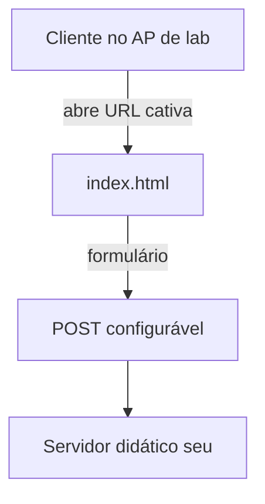

# 📶 wifi-captive-portal-phishing — Portal Cativo (Lab de Segurança)
<p align="center">
  
  <a href="https://github.com/panda12332145/wifi-captive-portal-phishing/commits/main"></a>
  <a href="https://github.com/panda12332145/wifi-captive-portal-phishing"></a>
  
</p>
---
> 🚨 **Somente laboratório autorizado:** simular portal cativo de Wi-Fi sem consentimento é **crime** (art. 154-A do Código Penal / Marco Civil da Internet). Execute apenas em redes próprias, isoladas e com todos os participantes cientes.

---
## 🔖 Resumo

Página de **portal cativo** em HTML puro que imita a tela de login de um provedor para **estudo de engenharia social e testes de conscientização em ambiente controlado**. Basta servir `index.html` num AP de laboratório e observar (em servidor próprio) o que os voluntários digitam. Sem backend embarcado: o destino do formulário é configurável.

### ✨ Funcionalidades Principais

- ✅ Página única autocontida (HTML + CSS + JS inline — zero dependências)
- ✅ Design responsivo imitando portal de provedor
- ✅ Formulário com validação e mensagem de sucesso simulada
- ✅ Sem webhook/URL externa embutida (sanitizado)
- ✅ Estrutura ideal para acrescentar seu próprio backend didático
- ✅ README com checklist de uso ético e legal

## 📽 Demonstração

```text
$ python -m http.server 8000
Serving HTTP on 0.0.0.0 port 8000 ...

# Abra http://<ip-da-maquina>:8000/index.html no cliente do lab
```

## ⚙️ Explicação das Partes Importantes

## 🔄 Fluxo de Trabalho / Arquitetura



## 📂 Estrutura do Projeto

```plaintext
wifi-captive-portal-phishing/
├── index.html            # portal cativo (renomeado de morangotango.html)
├── tests/                # estrutura
├── requirements.txt
└── README.md
```

## 🛠️ Tecnologias

| Ferramenta | Uso |
|---|---|
| **HTML5/CSS/JS** | Página autocontida |
| **Qualquer servidor estático** | Sob medida (http.server, nginx...) |

## ▶️ Instalação

```bash
git clone https://github.com/panda12332145/wifi-captive-portal-phishing.git
cd wifi-captive-portal-phishing
# sem dependências — é HTML puro
```

## 🚀 Execução

```bash
# Visualização rápida:
python -m http.server 8000
# http://localhost:8000/index.html

# No lab (AP isolado + consentimento dos participantes):
# 1. suba um AP sem internet numa VM/router próprio
# 2. sirva index.html como portal cativo
# 3. colete os dados SOMENTE no seu servidor didático
```

## 🧪 Testes

Verificação estrutural: `index.html` presente, sem URLs de webhook externas e sem scripts de terceiros.

## ⚠️ Limitações

- Não há coletor/backend — plugue o seu em um ambiente de testes
- Não inclui configuração de AP/redirecionamento (hostapd/dnsmasq ficam fora)
- Capturar credenciais de terceiros sem consentimento é crime — só lab

## 🚀 Roadmap

- [ ] Backend didático opcional (Flask) com aviso de consentimento na tela
- [ ] Variante com tema de hotel/aeroporto
- [ ] Página de aviso 'isto é um teste' pós-envio

## 📄 Licença

Todos os direitos reservados ao autor.

---

## 👾 Autor

<p align="center">
  
</p>

<p align="center">Feito por <strong>Panda12332145</strong> 👋🏽</p>

---

## 🧑‍💻 Sobre Mim

Sou apaixonado por **Física Teórica, Cibersegurança e Desenvolvimento de Sistemas**. Tenho grande interesse em programação de baixo nível, engenharia reversa, automação, sistemas Windows, criptografia e segurança ofensiva. Também gosto bastante de música, filosofia e computação avançada.

---

## 🌐 Redes

* **Site:** [https://panda-h0me.netlify.app/](https://panda-h0me.netlify.app/)
* **YouTube:** [https://www.youtube.com/@X86BinaryGhost](https://www.youtube.com/@X86BinaryGhost)
* **Instagram:** [https://www.instagram.com/01pandal10/](https://www.instagram.com/01pandal10/)
* **GitHub:** [https://github.com/panda12332145](https://github.com/panda12332145)
* **LinkedIn:** [linkedin.com/in/athos-da-boanergis](https://www.linkedin.com/in/athos-d%C3%A3-boanergis-5585a4288/)

---

## 🚀 Áreas de Interesse

* **Cibersegurança Avançada** 🔒
* **Hacking & Engenharia Reversa** 💻
* **Computação de Baixo Nível** 🖥️
* **Matemática e Física Teórica** 📐⚛️
* **Desenvolvimento de Ferramentas de Segurança** 🛠️

_"Conhecimento é poder, e domínio técnico vem da compreensão profunda dos sistemas."_

---

## 📞 Contato & Suporte

Para colaborações, dúvidas ou sugestões:

📧 **E-mail:** [athos.cybersec@gmail.com](mailto:athos.cybersec@gmail.com)

🐛 **Reportar Bug:** [Abrir Issue](https://github.com/panda12332145/wifi-captive-portal-phishing/issues)

💡 **Sugerir Melhoria:** [Discussions](https://github.com/panda12332145/wifi-captive-portal-phishing/discussions)
